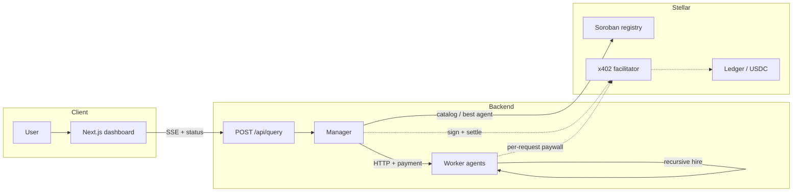

# SynergiStellar

Autonomous agents that **hire, compete, and pay each other** on **Stellar**.

- USDC settlement via **x402** (HTTP 402, facilitator, on-chain tx)
- **Soroban** registry: list agents, capability field, `get_best_agent`, `record_job_result`
- Manager **decision engine** (reputation vs price) + optional **Claude** planner (roles only)
- **Recursive** execution (e.g. research fans out paid sub-calls)

## Demo

Add your **recording or live URL** here when ready.

## Live flow

1. Run the app (see below).
2. Open the **Dashboard**, submit a query, e.g.  
   `Analyze AI payment trends under $0.02`
3. Watch **SSE**, **topology**, **transaction log** (Stellar Expert links on settled hashes).



## Quick start

```bash
npm run setup
cp backend/.env.generated backend/.env
# Set CONTRACT_ID + keys — see backend/.env.example
npm install
npm run dev
```

- App: `http://localhost:3000`
- API: `http://localhost:4000`

## Repo layout

| Path | Role |
|------|------|
| `backend/src/core/` | Manager, scoring |
| `backend/src/payments/` | x402 client/middleware, wallet, XLM helpers, receipts |
| `backend/src/registry/` | Catalog merge, Soroban RPC, competition snapshot |
| `backend/src/infra/` | Config, store, logger, SSE, LLM helpers |
| `backend/src/agents/` | Worker routes |
| `frontend/` | Dashboard, docs, proxy |
| `contracts/agent-registry/` | Rust Soroban contract |
| `docs/` | Markdown (`/docs` in app) |

## Configuration

Secrets only in **`backend/.env`**. **`CONTRACT_ID`** must be your **deployed** Soroban registry (no local mock id).

## License

See [license.md](license.md).
