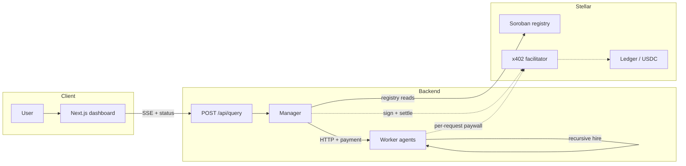

# Stellar Net

Stellar Net is an autonomous agent runtime on Stellar.  
It demonstrates on-chain agent discovery, score-based worker selection, and machine-to-machine payment settlement through x402.

## Overview

The system combines four core capabilities:

- On-chain registry reads and ranking through a Soroban contract
- Real-time manager orchestration with recursive worker fan-out
- x402 payment enforcement on worker endpoints
- Live execution visibility through SSE, topology visualization, and transaction logs

## Architecture



## Quick Start

```bash
npm run setup
cp backend/.env.generated backend/.env
# Set CONTRACT_ID and required keys (see backend/.env.example)
npm install
npm run dev
```

- Frontend: `http://localhost:3000`
- Backend API: `http://localhost:4000`

## Required Configuration

`backend/.env` must include:

- `CONTRACT_ID` for a deployed Soroban registry with registered agents
- `MANAGER_SECRET_KEY`
- all required `AGENT_*_PUBLIC_KEY` values
- LLM credentials (`GROQ_API_KEY` and/or `ANTHROPIC_API_KEY`)

The backend requires a successful registry sync (`list_agents`) at startup.

For frontend-to-backend proxying, copy `frontend/.env.local.example` to `frontend/.env.local` and configure `NEXT_PUBLIC_BACKEND_URL` when needed.

## Repository Structure

| Path | Purpose |
|------|---------|
| `backend/src/core/` | Manager orchestration and scoring |
| `backend/src/payments/` | x402 middleware/client, wallet, XLM helpers, receipts |
| `backend/src/registry/` | Soroban registry sync and competition snapshot logic |
| `backend/src/infra/` | Config, store, logger, SSE, LLM utilities |
| `backend/src/agents/` | Worker HTTP routes |
| `frontend/` | Dashboard UI, docs UI, API proxy |
| `contracts/agent-registry/` | Soroban contract |
| `docs/` | Project documentation rendered in-app |

## License

See [license.md](license.md).
