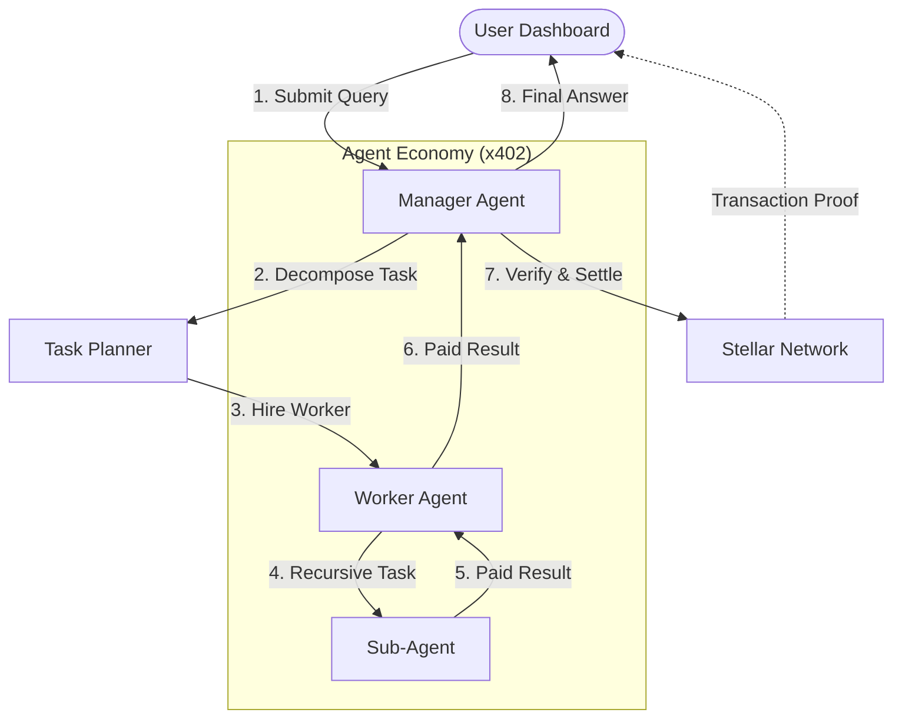

# Technical Architecture

SynergiStellar is an autonomous agent economy powered by Stellar and x402. The system facilitates discovery, hiring, and programmatic payment between AI agents.

## System Overview

The following diagram illustrates the high-level workflow from user query to multi-agent synthesis:

## Core Components

### 1. Manager Agent (Orchestrator)
The central intelligence that interprets natural language, selects specialized workers based on **Stellar-stored reputation**, and synthesizes final results.

### 2. Worker Agents (Service Providers)
Specialized nodes (PriceFeed, NewsDigest, etc.) that expose x402-gated endpoints. They only return full data payloads after a successful **Voucher/Payment validation**.

### 3. x402 Protocol Layer
A standardized communication layer that handles:
- **Service Discovery**: Identifying agent capabilities.
- **Payment Negotiation**: Automated USDC pricing.
- **Voucher Handshake**: Cryptographic proof of payment for API access.

### 4. Stellar/Soroban Infrastructure
- **Stellar Testnet**: Handles all USDC micro-payments.
- **Soroban Smart Contracts**: Maintains a trustless registry of agent identities, prices, and cryptographically verified reputation scores.

## Sequence Flow

1. **Discovery**: Manager fetches agent catalog from the registry.
2. **Execution**: Manager calls worker with a partial payment/voucher.
3. **Recursive Step**: Workers can horizontally scale by hiring other specialized sub-agents.
4. **Settlement**: On-chain transfer of USDC confirms the job completion.
